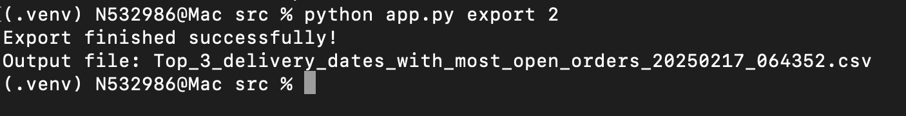

# Deel Data Engineering Task - Report Generator

This project provides a command-line interface (CLI) for generating reports from a PostgreSQL database.  It uses SQLAlchemy for database interaction and Click for building the CLI.

## Prerequisites

* **Python 3.7+:** Ensure you have Python 3.7 or later installed on your system.
* **PostgreSQL:** A running PostgreSQL database instance is required. By default, it uses the `finance_db` docker database.
* **Virtual Environment:**  FOr the purpose of this exercise, venv is necessary.

## Installation
Configure the database, as seen in [the main README file](../README.md#11).

## Run the python setup script
Clone this repository

Navigate to the src folder

Within the src folder, run:

python setup.py - This will create a virtual environment with all the dependencies and create some new tables that will be needed.

source .venv/bin/activate - Activate the virtual environment.
From this point the application is accessible.

## What it is made for
It's a very simple python script for creating CSV files with database export data.
The script itself is called app.py and it has 2 commands - list and export.
 - **List**: lists all available export operations
 - **Export**: receives an operation id and creates the report for that specific operation. The id can be gathered from the list command.
 
 Some operations might need extra arguments. The app you inform any missing ones and dive an usage example if necessary.

 The operations available are configured in a database, so 'reports' can be created and altered without code changes/deploys, making the maintenance easier.

 ### How to use
 Since it's just a python script, you can call it and, if something is wrong in your request, the app will inform you so you can run it again with correct parameters.

 ### Usage example:
 python app.py: list the available commands.
 

python app.py list: will list all the export operations available and their ids.

python app.py export 1: will generate a CSV with the data for that related report. If not data is found, the tool will inform you and generate no file.

Some operations may have extra options for filters and may require extra arguments.
python app.py export 6 '2025-02-25' 'COMPLETED'

On the surface that's all.

## Under the hood
For this task, I decided to create a very simple report tool, but with a bit of flexibility to grow.

The tool consists of an ORM only for loading a set of reports and their possible arguments.
This would allow the reports to be expanded with low effort and no need for coding and deploy.

Reports table

The reports can have placeholders for parameters or, for more flexible queries, entire blocks of filters can be dinamically generated.

Arguments

The arguments can be optional, can be embedded directly on the code with a placeholer of its name or belong to a dynamic block, such as where or group_by.

Berofe any query runs against the database, the arguments are scanned to avoid dangerous sql injections.

## The exporter
Data may be too big for a small container, or maybe a huge one, so we can configure the chunk_size to export the data incrementally, without the risk of memory restrain.

## Tests
I still could add some tests to make sure the csv exporter and the function that collects the connection arguments behave as expected in some specific scenarios. Given tthe short time, no great coverage.

## Room for improvement
- Simplistic architecture: None of the scenarios requested had any particular advanced solution requirement, so I just focused in trying to achieve a good experience for both users and devs, as far as CLI goes. It's robust and checks all the marks of the test, I hope.
- Hickups: I could not make the networking in docker work properly here and wasted quite a bit of time. I then decided to bring it down to the venv instead.
- More polish: specially regarding in the parameter usage, it might have some half-baked checks and roughness. I could not propperly test how different types might behave in real scenarios. Here more tests would help as well.